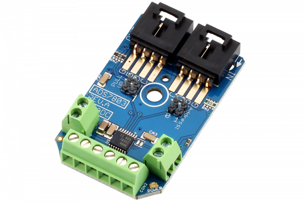

#ADS7830

The ADS7830 is an 8-Channel 8-Bit Analog to Digital Converter capable of supporting all standard I2C communications speeds. The ADS7830 is capable of 8-Channel single-ended input mode or 4-Channel differential input mode, making it an ideal choice for a wide range of unipolar and bipolar analog voltage measurement applications. 
This Device is available from www.ncd.io 

[SKU: ADS7830_I2CS]

(https://store.ncd.io/product/ads7830-8-channel-8-bit-high-speed-analog-to-digital-converter-i2c-mini-module/)
This Sample code can be used with Arduino.

Hardware needed to interface ADS7830 ADC with Arduino

1. <a href="https://store.ncd.io/product/i2c-shield-for-arduino-nano/">Arduino Nano</a>

2. <a href="https://store.ncd.io/product/i2c-shield-for-arduino-micro-with-i2c-expansion-port/">Arduino Micro</a>

3. <a href="https://store.ncd.io/product/i2c-shield-for-arduino-uno/">Arduino uno</a>

4. <a href="https://store.ncd.io/product/dual-i2c-shield-for-arduino-due-with-modular-communications-interface/">Arduino Due</a>

5. <a href="https://store.ncd.io/product/ads7830-8-channel-8-bit-high-speed-analog-to-digital-converter-i2c-mini-module/">ADC7830 8Channel 8Bit Analog To Digital Converter</a>

6. <a href="https://store.ncd.io/product/i%C2%B2c-cable/">I2C Cable</a>

ADS7830:

The ADS7830 is an 8-Channel 8-Bit Analog to Digital Converter capable of supporting all standard I2C communications speeds. The ADS7830 is capable of 8-Channel single-ended input mode or 4-Channel differential input mode, making it an ideal choice for a wide range of unipolar and bipolar analog voltage measurement applications. 

Applications:

•Voltage supply monitoring

•Isolated and remote data acquistion

•Battery operated systems

•Transducer interface

How to Use the ADS7830 Arduino Library
The ADS7830 has a number of settings, which can be configured based on user requirements.

1.Mode selection:The ADS7830 operating mode is determined by a command byte.

  1.Single ended/differential inputs selection:

       SD: Single-Ended/Differential Inputs
        0: Differential Inputs
        1: Single-Ended Inputs

        ads.setSDMode(SDMODE_SINGLE);       // Single-Ended Inputs
    
        ads.setSDMode(SDMODE_DIFF);       // Differential Inputs

   2.Power down selection mode:The following command selects the Internal reference "off" and ADC "on".

         ads.setPDMode(PDIROFF_ADON);        // Internal Reference OFF and A/D Converter ON

